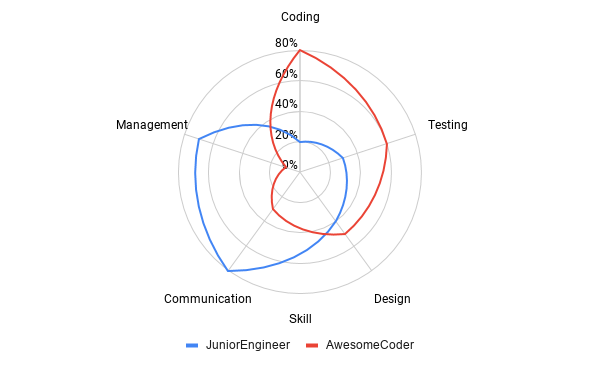
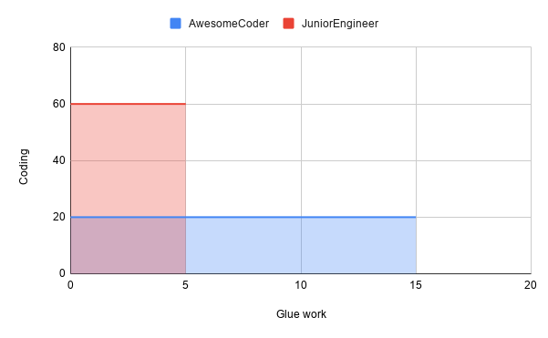

The theme that I always intend to write about is that software engineering is much more than code. Of course coding is a great deal of it (otherwise I wouldn't be interested in), but one cannot neglect the whole ecosystem around it. After reading [the article](https://noidea.dog/glue) and [watching the talk](https://www.youtube.com/watch?v=KClAPipnKqw) from Tanya Reilly ([@whereistanya](https://twitter.com/whereistanya)), I tend to believe she would agree with that.

Right at the beginning, Tanya sets the tone and captivates the audience. Rather than going for the easy way and just introduce herself, she starts by presenting the subject in a such an awesome way (with a good dose of humor) that you tell yourself: Girl, I want to hear what you have to say! From that on, she excels at her presentation skills.
Being "glue", as she describes, is doing all the parallel work that - apart from the code itself - make it possible to deliver features in a scalable way. Onboarding juniors, participating in design workshops, documenting features, among other activities. All that is pictured by Tanya through a mis en situation that I would like to develop.

The scenario consists of a junior engineer that joins a new team, where the codebase is complex and the colleagues are nice but very busy with their own features. Needless to say that the lack of documentation and a proper onboarding makes a tough time for her. Due to some situations, this engineer starts to take tasks long time neglected by the team like updating documentation and having alignment discussions with other teams. She gradually picks up more tasks like those. Her interactions improve the onboarding of newcomers, correct the direction of the product and improves the codebase stability.
Even her manager relies on her to understand the situation and unblock an AwesomeCoder colleague. All that makes her calendar so busy and full of meetings that she doesn't have time to invest on coding. Tanya then inquires: does this engineer deserve to be promoted?

One could say that to do such kind of glue work, the engineer must have a comprehensive understanding of the codebase, even without implementing new features. Possible, indeed, but could also be related to a kind of work sensibility, or common sense, that unblocked and improved situations. I am not saying this is not a reason to be promoted, just not enough. The same, I would argue, that being an awesome coder without this is not enough either. It's like when you play FIFA, you see the stats of your player on a radar graph and the larger the area, the more complete is the player.

Visualizing the problem from a graphical perspective always helps. Another possible analysis is to isolate the coding skills in a dimension and everything else (e.g. documentation, communication, team player, etc.) into another one. By plotting that on a Cartesian plan, one could see that investing only in one dimension, the area that you occupy is tends to be smaller, while compared to a scenario where you develop both. This is the meaning of complete. Being complete is being senior. It's based on completeness that a senior can generalize patterns and solve new challenges.

Now where could we improve the Tanya's scenario? I think she hits the point when she talks about the interaction with the manager of the engineer. Identifying a problem doesn't mean it's yours to fix it. Indeed, identifying and tackling the problem is sometimes the right thing to do, but life is made of priorities. Does fixing the problem spread your own graph? If it's not urgent and that someone else could fix it (or even spread their own graph with it) why not simply raising the flag?

I am not implying that it's the engineer's fault here. Nor the manager. For me it's rather a lack of communication from both parts. Tanya even raises this point in her article as well. What I am implying, though, it's that a shared problem. The manager cannot always ask the correct question either. That's why I believe in the frequent 1:1s. Not only frequent, but as well prepared by both parties. I have a very simple but effective template that I use with both my direct reports and my manager, so we can better organize our sessions.

Spreading the graph is not only good for personal development, but also for the team. I once worked in a very T-shaped team, where the work was very heterogeneous and, nevertheless, we trusted that anyone could work on it. The result is ex members of this team being System Architects, Experts, even working with Commercial to define the Product Strategy! Nobody is born knowing everything. On the contrary, you know what you experience. And instead of centralizing the knowledge in a single person, we have a stronger reliability with more people knowing to perform that task.

From an individual contributor perspective, take a look at your graph and see where do you want to spread. Talk to your Team Lead and work together to create opportunities for it. From a team lead perspective, look at every member and their tasks, and consider what would happen if this person is away for a while. How can you mitigate this risk?

_Cover by Branko Stancevic on Unsplash_
