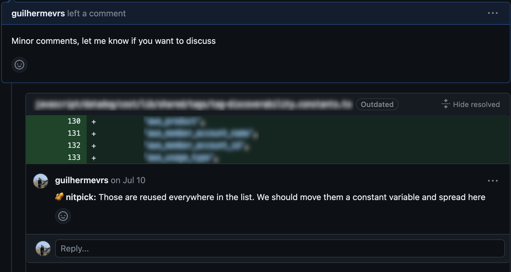
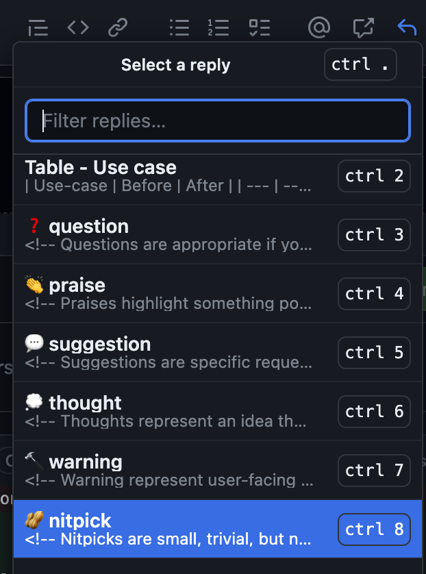

I didn't really like writing much when I was in school. I wasn't bad, but not very good either. It wasn't my strong suit. Numbers and formulas were easier to understand. Since then, I've improved a lot (although I still have much more to learn). I've found that treating a piece of writing like I treat my code works well. The biggest change was thinking of the message I want to share as a small system, with different parts that connect to each other, kind of like telling a story. Also, considering the people who will read it (like the users of a system), the situation, and how they will understand it (the user experience) was important to get better.

We don't access an undeclared variable, the same way we wouldn't use a word without knowing its meaning. You give functions meaningful names to show what they do, as you aim to use words that reflect your text's purpose. You break down a feature into smaller pieces, kind of like breaking a story into sections. I've realized that the idea of clarity holds true for both coding and writing. Just as you ensure your code makes sense and is easy to follow, you want your writing to be comprehensible and logical too.

Writing has become a really important skill for senior engineers. Especially nowadays, when lots of people are working from far away. Working from a distance has its good points, but it's tough to know if your message got across well, for example. You can't see body language, and we rely on emojis and how well the other person writes. Plus, there's the thing where we might not be working at the same time as others in different parts of the world. I remember this time when I was working on a project, and the person I was working with had totally different work hours. If we didn't understand each other, it would take a whole day to fix it.

## Writing skills

Writing needs practice. I like also decoupling it into abilities that I can train separatedly. This helps me focus on areas to improve, while contributing to the whole. There are two writing skills I am constanly looking at improving:

### ⛱️ Synthesis

Talking to someone about something feels way easier than writing about it. When you're talking, you can sort your thoughts out as you go, and it's alright. But when you write, things get more complicated. People often get confused in the middle of your writing. Maybe even right now, I might have lost some of you.

But here's a really important writing skill I'm always working on: synthesis. It's like taking a bunch of information, getting rid of what doesn't matter, and keeping what's really important. Imagine making something short and clear that still has all the main stuff you need. You could even think of it like a special way to compress information, just like when computers make files smaller without losing anything important.

### 🫶 Empathy

Think about this: you're working on a new speedy feature. You're putting in a lot of effort to find the best ways to make it fast. You decide to add a cache layer, which will speed up your data access. But then you realize that another team in your company takes care of this cache thing. So, you drop a message in their slack channel:

> <ins>Me</ins>: Hey! Could you please spin a new cache layer to my team?

But, because of the time difference, you don't get a reply until hours later. When you finally get a response, it says:

> <ins>Cache Team</ins>: Hey there! Sure thing, but why? What exactly are you trying to do? What do you need? Are you sure the cache layer is what you need? If you can give us more details, we'd be happy to help!

And now you're left with hours gone and still not getting what you needed. Is this the other team's fault? I don't really think so. I realize I was so unclear in what I asked for! Actually, I think the cache team did a great job by asking what info they were missing and offering help. To me, that's being empathetic to the person reading your message. It's like trying to understand what they might not know, guessing what context they might need, so the conversation flows smoothly.

## Writing contexts

Beyond the skills you need to write better, understanding contexts and opportunities is also a must. The senior you get, the more important it becomes. The following is a non-exaustive list of writing contexts that build up with seniorship and some tips on how to get better at it.

### 💬 Instant messages

Everybody uses tools like Slack or MS Teams to send quick messages at work. It doesn't matter how experienced you are. Remember when I talked about empathy? Well, I actually gave some useful tips for this kind of writing. Here are a few moew:

- Keep it simple
- Prefer using hyperlinks (like [this](https://zapier.com/blog/hyperlink-in-slack/)) instead of long URLs for shortness.
- If you're asking for something (like in the empathy example), I usually make the request and then provide more info in a context section below (or in the message thread).
  > Hey there! Could you make a new cache layer for my team?
  >
  > Context: We're working on this new feature (link to the document) and we need faster data access. You can find more details in the document.
- Don't just write "Hello". Check out the [No Hello initiative](https://nohello.net/en/)

### 🧑‍💻 Pull request review

As you get more used to the company, you start reviewing your colleague's code and sharing your own thoughts, questions, or suggestions. These situations can sometimes be nerve-wracking, especially when you're not clear about what you're trying to convey. I've been through this many times myself.

The internet is filled with lots of advice on how to do good code reviews (and write good pull requests), but the best tip I've found is to use [Conventional Comments](https://conventionalcomments.org/). I've actually saved them all in my Saved Replies list on GitHub. It's been a huge help, taking away the pressure of finding the right words and giving me more space to focus on the code itself.

### 📄 Request For Comments (RFC)

Now, imagine you're in charge of a big feature or project. You've got a few possible solutions in mind, each with its own good and not-so-good points. Naturally, you have your favorites, but you need to share them with real reasons behind your choices. That's where RFCs (Request For Comments) come into play. They're like a great way to have discussions like this. Here are some tips I follow:

- First, have a ready-to-use document template. Your company might have one already, so it's worth checking before reinventing the wheel.
- Write down all the solutions you've thought about, and talk about the good and not-so-good sides of each. Also, point out which one you recommend and explain why. I've been really surprised in a good way when colleagues challenged my assumptions, making me rethink options I had dismissed earlier (and sometimes end up recommending them).
- Keep the document's status clear. Whether it's a draft, under review, or accepted. Also, keep track of changes you make—additions, removals, modifications. This really helps reviewers understand how the conversation is progressing.
- Keep a list of questions that are still open (and those that are resolved). You might not have all the answers when you send out the document for review.
- Be on the lookout for side discussions. Remember, your RFC doesn't need to be all about nitty-gritty implementation details. It's good to leave some room for tweaks as things progress. Sometimes, when side talks pop up, it's better to refocus the document on the more pressing topics and save other questions for later (as long as they don't block what you're recommending).

### 🤔 Weekly notes

I've seen all of the above practices in different companies, but it was when I joined Datadog that I discovered something really cool: Weekly snippets! While chatting with a colleague, he showed me the weekly notes he takes. He shared what he has achieved, what's still ongoing, and what he has been thinking about. You know what's even more interesting? He writes it for... himself. It's public, anyone can read it, but the main audience is his future self.

I could talk about this, but there are already [great articles](http://blog.idonethis.com/google-snippets-internal-tool/) and [other pieces](https://mtlynch.io/status-updates-to-nobody/) that cover it well. So, I'll just say that I've been doing this for 6 months now and I've learned so much from it. I organize my snippets like this:

**🚢 Shipped**: Anything I've finished this week. It's a nice way to reflect on the past week's accomplishments.

**🛫 On-going**: What I'm currently working on. This really helps my future self know where to pick up next week.

**🔮 Coming ahead**: Things I should keep an eye on in the future. It helps me plan my actions for maximum impact.

**📚 Learned**: Stuff I've learned this week. It's like building my own knowledge base for the future.

**🧠 Brain dump**: Anything that popped into my head during the week that doesn't fit in the previous sections but is interesting to note (like a cool conversation I had in a meeting).

Other folks at Datadog do this too. We even have a Slack channel where people share links to their new snippets. It's fantastic! I enjoy reading snippets from colleagues I don't directly work with (I learn so much). But I especially love reading from those I do work with because I have more context about what they're talking about.

## Final thoughts

In the end, what I want to say is that treating writing like I treat my code helps me get better at it. I try to write as simple and direct as I can, while thinking about the person who will read it. This is what works for me. I also pick up helpful tips and learn from styles I like. Here are some articles you might find interesting:

[Remote work requires communicating more, less frequently - Ben Balter](https://ben.balter.com/2023/08/04/remote-work-communicate-more-with-less/)

[Some tactics for writing in public - Julia Evans](https://jvns.ca/blog/2023/08/07/tactics-for-writing-in-public/)

[Write about what you learn. It pushes you to understand topics better - Addy Osmani](https://addyosmani.com/blog/write-learn/)

_Photo by Glenn Carstens-Peters on Unsplash_
