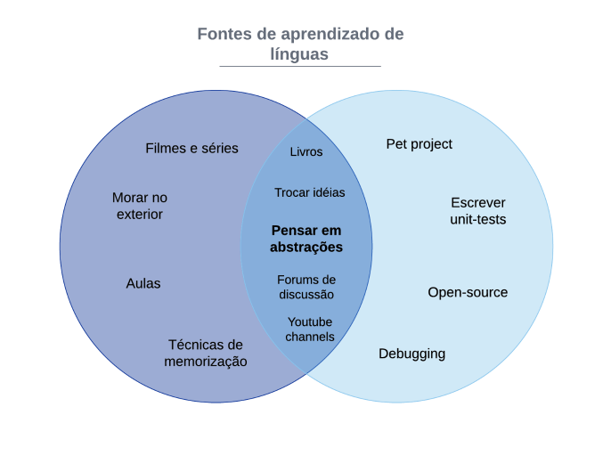
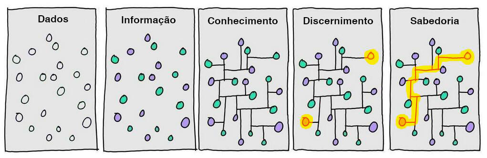
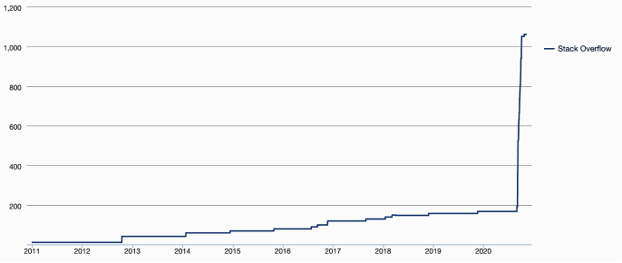

_Sprichst du Kotlin?_

Quando me mudei para Frankfurt, comecei a aprender alemão. Aprender uma nova língua sempre foi para mim uma viagem que começa no nível mais difícil e se torna mais fácil com o tempo. O alemão não é diferente. Mesmo que 8 meses ainda não tenham sido suficientes para me sentir à vontade, devo dizer que estou menos perdido do que no início.
O que isso tem a ver com o desenvolvimento? Bem, as linguagens de programação me oferecem um passeio semelhante.

Ambos os tipos são sistemas de comunicação estruturados que podem ser usados para dar ordens ou instruções. Eles são baseados em uma gramática que define o que é sintaticamente correto e podem evoluir com o tempo. Gírias e expressões são adicionadas às linguagens faladas como bibliotecas e frameworks às de programação. E há sempre mais de uma maneira de expressar algo. Comecei a pensar neste paralelo desde que decidi também assumir o desafio de aprender Kotlin - uma linguagem de programação completamente nova para mim.

Acredito que a aquisição de novas habilidades ajuda meu cérebro a se desenvolver, criar novas conexões e mantê-lo em forma. Como qualquer esporte ou exercício que faço para o meu corpo. Salvar algum tempo para essas atividades é primordial, e eu me asseguro de incluí-las em meu [processo de gestão de tempo](/posts/time-management-for-leaders/). Como eu ainda tenho bastante dificuldade, por que não registrar aqui minhas experiências. Tentando abordar o assunto de forma estruturada. Meio que achatando a curva de aprendizado, ao mesmo tempo em que estabeleço expectativas coerentes.

> Aprender NÃO é um processo linear

## Aceite o caos 🤯

Meu lema sobre o assunto é: **Aprender NÃO é um processo linear**. Não o trate como se fosse. Embora tenhamos marcos em ambos os domínios (por exemplo, falar de coisas do passado ou testes unitários), eles não seguem nenhuma ordem em particular. É o caos puro. É como mergulhar em uma piscina de dados diferentes que não têm nenhum sentido para você no início. É um vai e vem constante entre _"acho que estou entendendo o que está acontecendo "_ e _"eu nunca vou aprender isso"_.

Como isso não segue uma tendência linear, enfrentá-lo de diferentes perspectivas se faz necessário. Identificar todas as fontes de dados possíveis, ortodoxas ou não, e construir seu próprio inventário a partir delas. Isto é muito útil para novos conceitos. Vê-los de diferentes perspectivas nunca me decepciona. Abaixo você pode ver meus inventários até agora, com a interseção entre ambos. Mais um paralelo entre os dois mundos - programação e linguística.

## Aprender através de conexões 🖇️

Sempre acho mais fácil assimilar quando novos conceitos podem se relacionar com conceitos anteriores. Essas relações podem ser entre áreas completamente diferentes. Eu nunca vou esquecer, por exemplo, que _"tropeçar"_, em francês, é _"trébucher"_, por cause da fonte no Microsoft Word -- [Trebuchet MS](https://docs.microsoft.com/en-us/typography/font-list/trebuchet-ms) -- mesmo se os dois não tem nada a ver.

É óbvio que existem relações do mesmo conceito. The mental effort of making the link seems to be less important even. I was gladly surprised to see that [Room](https://developer.android.com/topic/libraries/architecture/room) -- the Kotlin abstraction layer for SQL -- shares concepts already familiar to me from other experiences, like [entity models from Entity Framework](https://docs.microsoft.com/en-us/ef/) and the [migrations from Ruby on Rails](https://guides.rubyonrails.org/v3.2/migrations.html).

Tudo isso para dizer que este tipo de técnica te dá novos pontos de partida e te desbloqueia de becos sem saída. Não sabe por onde começar? Bem, procure por conceitos de outros idiomas que você esperaria ver no novo. Para uma língua falada, como você se apresenta ou encomenda uma pizza? Ou para uma linguagem de programação, como você faz iterações sobre uma lista ou divide seu código em arquivos? Todos estes são exemplos que você relaciona a partir de outros idiomas conhecidos. Agora, digamos que você fica preso, não consegue entender um conceito ou uma palavra específica. Pense nas poucas primeiras coisas que lhe vêm à mente, talvez criar uma história em torno delas. Isto geralmente é o suficiente para me desbloquear.

**Bonus:** Especialmente para linguas faladas, se você não conhece [Anki](https://apps.ankiweb.net/) ainda, você está perdendo uma excelente ferramenta.

## Aprender através de questões 🙌

Outra abordagem que venho utilizando muito é basear meu plano de aprendizado em perguntas e pontos em aberto. Como dito anteriormente, não estamos falando de um processo linear e muitas vezes ele não segue uma seqüência. Poderíamos muito bem seguir em frente sem realmente ter um bom controle sobre um conceito e retornar mais tarde, quando se tem outras partes do quebra-cabeça. Mantendo, no entanto, uma lista desses itens pulados.

Pode parecer super estúpido ou simples, mas enfrentar um problema de forma estruturada não significa que você precise de uma solução complexa. Muito freqüentemente é fazer, de forma consciente, o que você inconscientemente faz. Eu não paro de ler um texto só porque não sei o significado de uma única palavra. Eu anoto (ou destaco no texto) para procurá-lo mais tarde. Da mesma forma, eu marco com uma TODO um pedaço de código que não estou muito certo de que esteja bem escrito.

Ao responder a uma pergunta, você aplica o conhecimento adquirido. Não apenas suas próprias perguntas, mas também de outras que, como eu, embarcaram nesta busca. Claro, qualquer desenvolvedor pensaria imediatamente em [StackOverflow](https://stackoverflow.com/) para programação, mas, você sabe que você tem o mesmo para as linguagens? Existe, por exemplo, o [German Language StackExchange](https://german.stackexchange.com/). O que eu gosto nesta abordagem é que você pode até mesmo transformar isso em um jogo ganhando pontos de reputação. No mês passado, eu me desafiei a alcançar a [reputação de 1k](https://stackoverflow.com/users/556629/guilhermevrs) para Typescript em apenas 30 dias e aprendi bastante durante o processo.

Eu realmente acredito que não há uma maneira certa ou errada de aprender. Isso varia de pessoa à pessoa, de conceito á conceito. Mas quando você encontra os meios com os quais você se identifica e começa a usá-los, com a mentalidade correta, muito provavelmente não vai mais parar. Basta começar!
