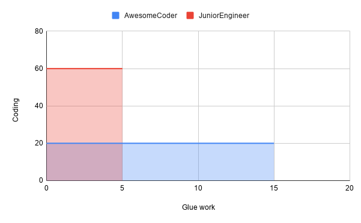

O tema sobre o qual sempre pretendo escrever nesse blog é que engenharia de software é muito mais do que código. É claro que boa parte disso é programação (caso contrário eu não estaria interessado), mas não se pode negligenciar todo o ecossistema ao seu redor. Depois de ler [o artigo](https://noidea.dog/glue) e [assistir à palestra](https://www.youtube.com/watch?v=KClAPipnKqw) de Tanya Reilly ([@whereistanya](https://twitter.com/whereistanya)), eu acho que ela concorda com isso.

Logo no início, Tanya dá o tom e cativa o público. Em vez de ir pelo caminho mais fácil e apenas se apresentar, ela começa com o assunto de uma maneira tão incrível (com uma boa dose de humor) que você diz a si mesmo: Eu quero ouvir o que você tem a dizer! A partir daí, ela dá um show de apresentação.
_Being glue_ (numa tradução livre _ser a cola_), como ela descreve, é fazer todo o trabalho paralelo que, junto com a programação, torna possível entregar features de uma forma escalável. Integrar juniores, participar da concepção de design, documentar recursos, entre outras atividades. Tudo isso é retratado por Tanya através de uma historinha que eu gostaria de desenvolver.

O cenário consiste em uma engenheira júnior que se junta a uma nova equipe, onde a base de código é complexa e os colegas são simpáticos, mas muito ocupados com suas próprias tarefas. Nem precisa dizer que a falta de documentação e um bom processo de onboarding tornam as coisas mais difíceis para ela. Devido a algumas situações, esta engenheira começa a assumir tarefas há muito tempo negligenciadas pela equipe como atualização de documentação e discussões de alinhamento com outras equipes. Aos poucos, ela vai assumindo mais tarefas como essas. Suas interações melhoram o embarque de recém-chegados, corrigem a direção do produto e melhoram a estabilidade da base de código.
Até seu gerente conta com ela para entender a situação e desbloquear um colega (a.k.a AwesomeCoder). Tudo isso torna seu calendário tão ocupado e cheio de reuniões que ela não tem tempo para investir na programação. Tanya então pergunta: esta engenheira merece ser promovida?

Pode-se dizer que para fazer tal tipo de trabalho (trabalho de cola), o engenheiro deve ter um entendimento abrangente da base de código, mesmo sem implementar novas features. É possível, de fato, mas também pode estar relacionado a um tipo de sensibilidade de trabalho, ou senso comum, que desbloqueia e melhora as situações. Não estou dizendo que isto não é motivo de promoção, apenas que não é suficiente. O mesmo vale, eu diria, para um programador fantástico que, sem isso, também não seria suficiente. É como quando você joga FIFA, você vê as estatísticas de seu jogador em um gráfico de radar e quanto maior a área, mais completo é o jogador.

Visualizar o problema a partir de uma perspectiva gráfica sempre ajuda. Outra análise que poderíamos fazer é isolar as habilidades de codificação em uma dimensão e todo o resto (por exemplo, documentação, comunicação, espírito de equipe, etc.) em outra. Traçando isso em um plano cartesiano, pode-se ver que investindo apenas em uma dimensão, a área que você ocupa tende a ser menor, enquanto comparada a um cenário onde você desenvolve ambos. Isto é completude. A completude é ser senior. É com base na completude que um sênior pode generalizar padrões e resolver novos desafios.

Agora, onde poderíamos melhorar o cenário de Tanya? Acho que ela chega ao ponto quando fala sobre a interação com o gerente do engenheiro. Identificar um problema não significa que é seu para resolvê-lo. De fato, identificar e corrigir o problema às vezes é a coisa certa a fazer, mas a vida é feita de prioridades. Consertar o problema expande seu próprio gráfico? Se não é urgente e que alguém pode consertá-lo (ou até mesmo expandir seu próprio gráfico com ele), por que não simplesmente _raise the flag_?

Não estou insinuando que a culpa aqui é da engenheira. Nem do gerente. Para mim, é antes de tudo uma falta de comunicação entre ambas as partes. Tanya até levanta este ponto em seu artigo também. O que estou insinuando, no entanto, é que é um problema compartilhado. O gerente também nem sempre pode fazer a pergunta correta. É por isso que eu acredito nas freqüentes 1:1s. Não só freqüentes, mas também bem preparadas por ambas as partes. Tenho um modelo muito simples mas eficaz que uso tanto com a minha equipe quanto com meu gerente direto, para que possamos organizar melhor nossas sessões.

Expandir o gráfico não só é bom para o desenvolvimento pessoal, mas também para a equipe. Uma vez trabalhei em uma equipe onde o trabalho era muito heterogêneo e, no entanto, confiávamos que qualquer um poderia trabalhar em qualquer uma das tarefas. O resultado é que ex-membros desta equipe são hoje arquitetos de sistema, especialistas, até mesmo trabalhando com o comercial para definir a estratégia da plataforma digital! Ninguém nasce sabendo de tudo. Ao contrário, você sabe o que experimenta. Ao invés de centralizar o conhecimento em uma única pessoa, temos uma confiabilidade mais forte, com mais pessoas sabendo realizar essa tarefa.

Na perspectiva de um colaborador individual, dê uma olhada em seu gráfico e veja onde você quer se expandir. Tenha esta conversa com seu líder de equipe e trabalhem juntos em oportunidades para isso. Na perspectiva de líder de equipe, olhe para cada membro e suas tarefas, e considere o que aconteceria se essa pessoa estivesse ausente por um tempo. Como você pode mitigar este risco?

_Foto de Branko Stancevic on Unsplash_
