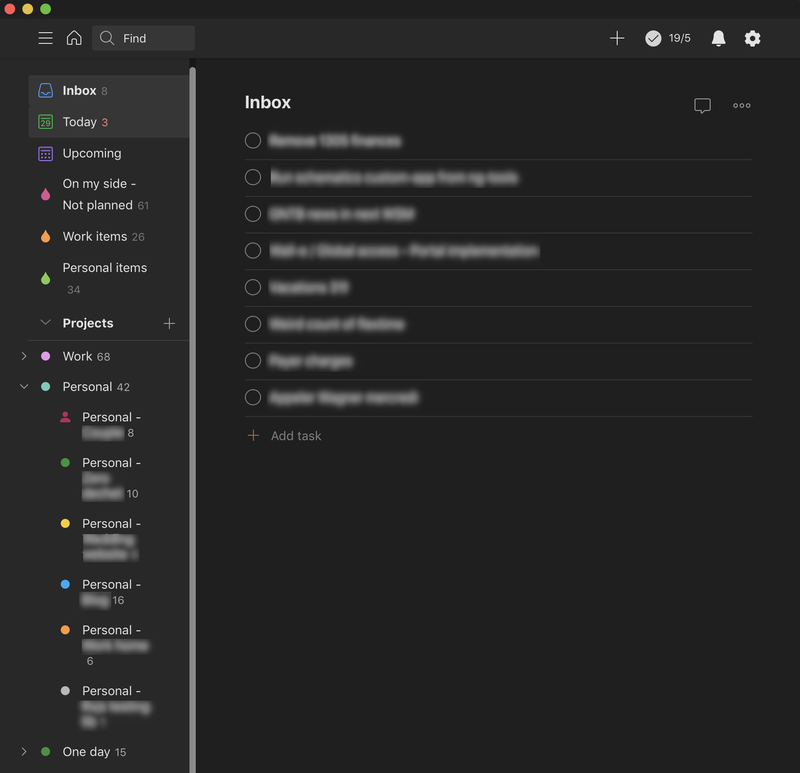
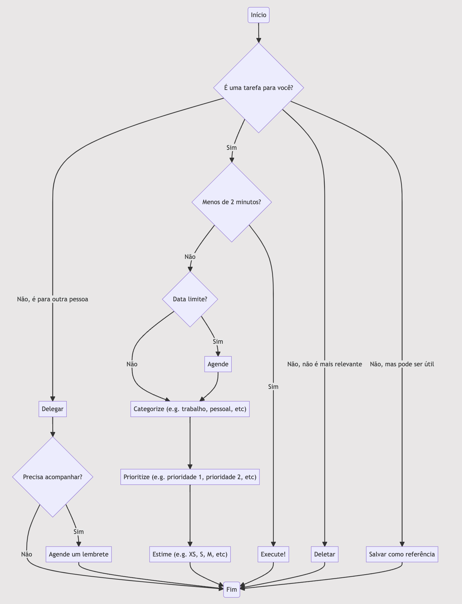
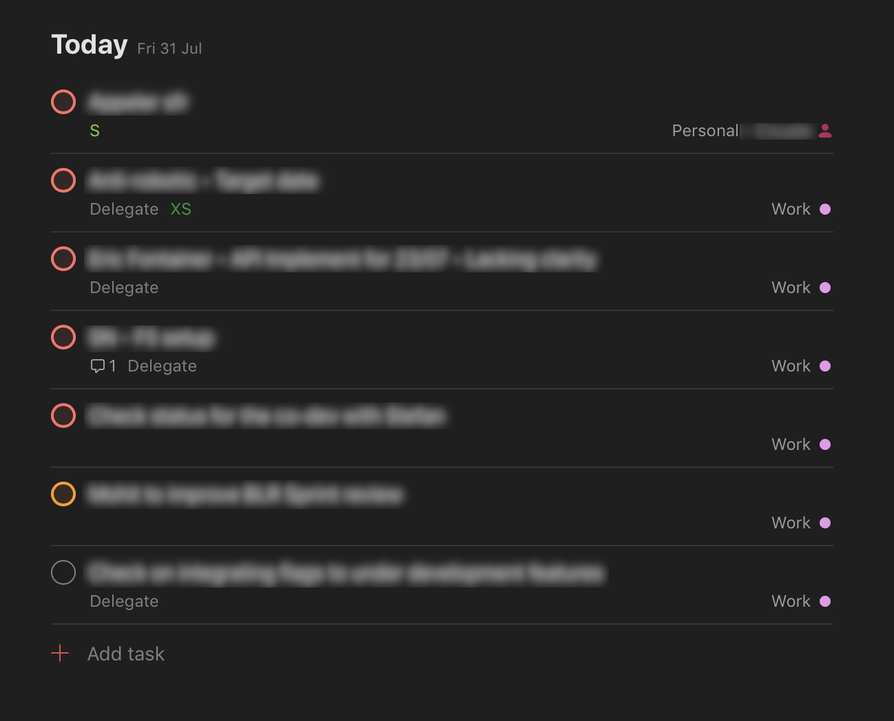

O dia começa: uma lista enorme de e-mails e conversas não lidas do dia anterior espera por você. Post-its e lembretes que você escreveu na semana passada ainda precisam ser executados e uma notificação do seu calendário informa que você já está atrasado para uma reunião. Você decide prestar atenção nela (senão você não vai conseguir seguir o assunto) e, durante esse tempo, a lista de items continua a crescer... Eu perdi a conta de quantas vezes isso aconteceu comigo.

**Gerenciamento de tempo é uma necessidade básica para qualquer líder** nessas situações. O _context switch_[^1] presente nessa função (eu ainda quero escrever sobre minha percepção em o que é ser um líder) **implica uma enchente de informação, tarefas e pensamentos vindos de todos os lados**. Eu considero também as tarefas e pensamentos no contexto da **vida pessoal, que não devem ser negligenciados**. Tudo isso precisa ser processado e, por isso, **demanda tempo**. Como tempo é **um recurso limitado, gerenciá-lo é essencial**.

Fazem alguns anos que eu leio livros e artigos sobre o assunto para tentar construir meu próprio algoritmo. Assim como minha vida, meu algoritmo evolui e ganha atualizações. Hoje é uma **versão híbrida** do famoso **_Getting Things Done (GTD)_**[^2], criado por David Allen ([livro original](https://www.amazon.com/Getting-Things-Done-Stress-free-Productivity/dp/0349408947/ref=asc_df_0349408947/) e [livro em português](https://www.amazon.com.br/Arte-Fazer-Acontecer-David-Allen/dp/8543102812)). Eu considero híbrido porque ainda não consegui me motivar para terminar de ler (muita abobrinha pro meu gosto). Mas tem sim alguns aspectos / fundamentos que eu gosto bastante e que vão ser descritos aqui.

Eu vou também descrever como eu aplico o método usando **Todoist** ([website](https://www.todoist.com/)), uma **aplicação bem feita para o gerenciamento de tarefas**. Eles propõem uma versão gratuita, mas honestamente, **a versão paga são os 3 euros mais bem pagos por mês**. A versão gratuita é legal para descobrir o app, mas eu uso bastante **as funcionalidades pagas como comentários, etiquetas e filtros** (eu sou Mestre no sistema de pontos de karma deles :nerd_face:).

## 1) Nosso cérebro é um executor, não um armazém 🧠

Esse é o mais impactante para mim. Basicamente, isso é uma afirmação que **nosso cérebro é concebido para executar tarefas e criar coisas, não para guardar números / senhas / datas / etc**. Traduzindo isso em outras palavras, isso significa que **qualquer informação** -- não interessando se é uma tarefa ou não -- **precisa ser salvo em algum lugar, imediatamente**, antes que ela se perca. De preferência salvos **no mesmo lugar (referido como Inbox[^3])**, senão você vai ter que se lembrar de onde você a salvou :wink:.

É basicamente isso: qualquer coisa que você vê, lê ou pensa vai **diretamente para a Inbox para ser processado no momento certo**. E quando eu digo processado, não significa apenas a **execução, mas também a categorização, estimação e agendamento**. Eu normalmente **começo meu dia checando todos os canais possíveis** (e-mails pessoais e profissionais, chats, post-its e pensamentos aleatórios) e adiciono **um item na Inbox para cada um**.

**Dica:** Lembre-se que o seu cérebro não vai guardar o contexto de cada item na Inbox. Faça o esforço de **ser claro o suficiente na descrição dos items**, senão você terá problemas mais tarde quando você vai processá-los.

## 2) Sua Inbox precisa ser processada todos os dias ⚙️

Não é porque as tarefas vão para a Inbox que elas vão desaparecer ou se completar magicamente. Depois de checar todos os canais, eu processo cada item na inbox, na ordem que elas foram registradas. Cada item segue o seguinte processo (fortemente baseado no processo GTD):

{{/*
graph TD;
    begin(Início)
    id1{É uma tarefa para você?};
    id2[Salvar como referência]
    id3[Delegar]
    id4[Deletar]
    id5{Menos de 2 minutos?}
    id6[Execute!]
    id7["Categorize #40;e.g. trabalho, pessoal, etc#41;"]
    id8["Prioritize #40;e.g. prioridade 1, prioridade 2, etc#41;"]
    id9["Estime #40;e.g. XS, S, M, etc#41;"]
    id10{Data limite?}
    id11[Agende]
    id12{Precisa acompanhar?}
    id13[Agende um lembrete]
    id14(Fim)
    begin-->id1
    id1-- Não, mas pode ser útil -->id2
    id1-- Não, é para outra pessoa -->id3
    id1-- Não, não é mais relevante -->id4
    id1-- Sim -->id5
    id5-- Sim -->id6
    id5-- Não -->id10
    id10-- Não -->id7
    id10-- Sim -->id11
    id11-->id7
    id7-->id8
    id8-->id9
    id3-->id12
    id12-- Não --> id14
    id12-- Sim -->id13
    id13 & id9 & id6 & id4 & id2-->id14
*/}}

Alguns comentários sobre as decisões acima:

- O fato de **anotar tudo**, mesmo o que não é uma tarefa, **retira o esforço** de checar se algo é uma ação ou não e quando deve ser feito.
- Como no GTD de base, se uma ação leva **menos que 2 minutos** para ser completada, **_faça imediatamente!_** Vai te custar mais tempo e energia se você tentar administrar isso.
- **Delegar não significa esquecer**. Separe da sua lista de coisas, mas coloque um lembrete no que precisa ser cobrado / acompanhado. **Eu tenho uma etiqueta específica para isso!**
- Estimar cada item vai te ajudar mais tarde a **executar os menores itens mais importante em primeiro** e produzir aquela boa dose de [dopamina](https://pt.wikipedia.org/wiki/Dopamina) no corpo.

## 3) Verifique as tarefas do dia 📆

Lembra que na etapa anterior, você agendou tarefas (e delegações) para os items da sua inbox? Bem, agora é o momento quando você confere a lista do dia. Aqui, eu normalmente não dou a mínima para a categoria. **A tarefa foi agendada pour uma rasão!** Nesse caso, eu aconselho a **organizar a sua agenda do dia para ter um tempo para essas tarefas** considerando reuniões previamente agendadas, o tamanho das tarefas, etc.

## 4) Hora do trabalho 💪

Agora que você identificou as tarefas do dia (talvez até completando algumas delas), é hora de se por à serviço. Verifique as **prioridades e estimativas**, comece pelas **menores e mais importantes tarefas**. Qualquer novo item que chega **durante o dia, envie para a inbox para ser processado no dia seguinte**. Você pode estar se perguntando: mas e se for urgente? Bem, nesse caso, tome o tempo necessário para analisar se a tarefa precisa mesmo ser executada hoje, considerando as outras tarefas já previstas para hoje. Feito isso, decida se é algo realmente para hoje ou se pode ser enviada para a inbox.

Como a minha vida hoje é dividida em pessoal e profissional, eu tenho três filtros principais:

- **Personal items:** `#Personal* & (p1 | p2 | p3) & !@Delegate` -- Minhas tarefas no âmbito pessoal
- **Work items:** `#Work* & (p1 | p2 | p3) & !@Delegate` -- Minhas tarefas no âmbito profissional
- **On my side:** `!@Delegate & (p1 | p2 | p3) & !#Inbox` -- Qualquer tarefa minha que tenha sido processada (fora da inbox)

Você deve ter notado que tarefas marcadas com a etiqueta _Delegate_ não aparecem nos meus filtros. Isso **alivia a pressão e simplifica muito a lista**, sem perder o controle.

## 5) Revise a lista 🔎

O último passo é talvez o mais importante. **_Prioridades mudam a cada segundo_**. No momento seguinte após ter processado uma tarefa da inbox, a prioridade que você colocou pode ter mudado já. Outra coisa muito comum que acontece: Você sempre terá itens de prioridade 1, mas quando é que itens de prioridade 2, 3, etc vão ter o seu momento para brilhar?

É por isso que **revisar a lista é importante**. Revise as prioridades! Verifique itens de prioridade 1 e pergunte a sí mesmo se sâo imprescindíveis. Verifique o que você colocou como prioridade 2 e 3 e pergunte-se se já não é hora de promovê-las à prioridade 1. E mais importante ainda, verifique se os ítens ainda são relevantes! Se não forem, delete-os :see_no_evil:

Se seguirmos o livro ao pé da letra, eu acho que essa revisão deve ocorrer toda a semana. **Revisar a cada 2 semanas funciona legal para mim** (como se fosse uma Sprint no Scrum). Eu separo uma hora para revisar a direção que eu estou tomando no profissional como no pessoal. Eu então reflito no que está faltando -- que projetos eu estou deixando para trás -- e comparo com o valor que eles poderiam me trazer. Se eu preciso fazer uma inversão, eu simplesmente mudo as prioridades.

E aí..Pronto para tentar?

**Atualização:** Eu descobri recentemente [esse artigo](https://www.deprocrastination.co/blog/how-to-stop-procrastinating-by-using-the-fogg-behavior-model) (em inglês apenas, mas um Google Translate da vida pode te ajudar) sobre Fogg Behavior Model. Esse modelo tenta explicar como o comportamento humano (mais precisamente a procastinação) funciona. Há vários aspectos nesse estudo que eu consigo identificar no meu próprio comportamento e que talvez até explique porque essa técnica de gerenciamento de tempo funciona para mim. Dá uma olhada nesse link :wink:.

[^1]: Termo inglês que define uma mudança de contexto, de foco, de atividade.
[^2]: Em uma tradução livre, "fazer as coisas acontecerem".
[^3]: Caixa de entrada.
