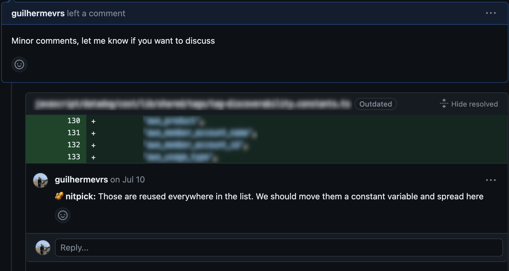
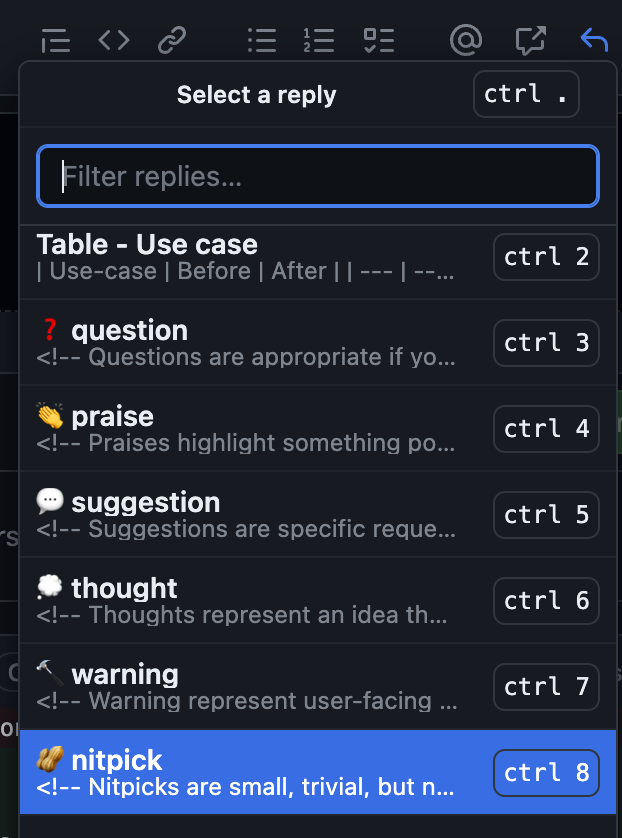

Eu realmente não gostava muito de escrever quando estava na escola. Eu não era ruim, mas também não era muito bom. Números e fórmulas eram mais fáceis de entender. Desde então, melhorei bastante (embora ainda tenha muito mais a aprender). Descobri que tratar um texto como trato meu código funciona bem. A maior mudança foi pensar na mensagem que quero compartilhar como um sistema pequeno, com diferentes partes que se conectam umas às outras, meio que contando uma história. Além disso, considerar as pessoas que vão lê-lo como os usuários de um sistema, a situação e como elas vão entendê-lo (a experiência do usuário) foi importante para melhorar.

Não acessamos uma variável não declarada da mesma forma que não usaríamos uma palavra sem conhecer seu significado. Você dá bons nomes às funções para mostrar o que elas fazem, assim como você visa usar palavras que reflitam o propósito do seu texto. Você divide uma feature em partes menores, meio que como dividir uma história em seções. Percebi que a ideia de clareza é válida tanto para programação quanto para escrita. Assim como você garante que seu código faça sentido e seja fácil de entender, você quer que sua escrita seja compreensível também.

Escrever se tornou uma habilidade realmente importante para engenheiros senior. Especialmente nos dias de hoje, quando muitas pessoas estão trabalhando à distância. Trabalhar remotamente tem seus pontos positivos, mas é difícil, por exemplo, saber se sua mensagem foi compreendia corretamente. Não dá para ver a linguagem corporal do outro, nós dependemos de emojis e de quão bem a outra pessoa escreve. Além disso, tem essa questão de talvez não estarmos trabalhando ao mesmo tempo que outras pessoas em diferentes partes do mundo. Lembro de uma vez em que estava trabalhando em um projeto, e a pessoa com quem eu estava trabalhando tinha horários de trabalho totalmente diferentes. Se um pedido meu não fosse bem entendido, levaria um dia inteiro para resolver isso.

## Habilidades de escrita

Escrever requer prática. Gosto de dividir isso em habilidades que posso treinar separadamente. Isso me ajuda a focar nas áreas a melhorar. Existem duas habilidades de escrita nas quais estou sempre buscando melhorar:

### ⛱️ Síntese

Conversar com alguém sobre algo parece muito mais fácil do que escrever sobre esse mesmo assunto. Quando você está falando, pode organizar seus pensamentos enquanto fala, e está tudo bem. Mas quando você escreve, as coisas ficam mais complicadas. As pessoas muitas vezes ficam confusas no meio do seu texto. Talvez até agora mesmo, eu possa ter perdido alguns de vocês.

Aqui está uma habilidade de escrita realmente importante em que estou sempre trabalhando: síntese. É como pegar um monte de informações, eliminar o que não importa e manter o que é realmente importante. Imagine criar algo curto e claro que ainda contenha todas as informações principais de que você precisa. Você poderia até pensar nisso como uma forma especial de compactar informações, assim como os computadores tornam os arquivos menores sem perder nada importante.

### 🫶 Empatia

Pense nisso: você está trabalhando em uma nova funcionalidade que precisa ser rápida. Você está se esforçando muito para encontrar as melhores maneiras de torná-la rápida o suficiente. Você decide adicionar uma camada de cache, que acelerará o acesso aos seus dados. Mas então você percebe que outra equipe em sua empresa cuida desse tipo de camada. Então, você deixa uma mensagem no channel deles no Slack:

> <ins>Eu</ins>: Ei! Você poderia criar uma nova camada de cache para minha equipe, por favor?

Devido à diferença de horário, você não recebe uma resposta até horas depois. Quando finalmente obtém uma resposta, ela diz:

> <ins>Equipe de Cache</ins>: Olá! Claro, mas por quê? O que exatamente você está tentando fazer? Do que você precisa? Tem certeza de que a camada de cache é o que você precisa? Se você puder nos dar mais detalhes, teremos prazer em ajudar!

E agora você ficou horas sem conseguir o que precisava. A culpa é da outra equipe? Eu não acho. Eu fui tão vago no que pedi! Na verdade, acho que a equipe de cache fez um ótimo trabalho ao perguntar que informações estavam faltando e oferecer ajuda. Para mim, isso é ser empático com a pessoa que lê sua mensagem. É como tentar entender o que eles podem não saber, adivinhar que contexto eles podem precisar, para que a conversa flua tranquilamente.

## Contextos

Além das habilidades necessárias para escrever melhor, entender os contextos e oportunidades também é essencial. Quanto mais sênior você se torna, mais importante isso fica. A seguir, está uma lista não exaustiva de contextos de escrita que aparecem com a senioridade e algumas dicas sobre como melhorar nesses contextos.

### 💬 Mensagens de chat

Todo mundo usa ferramentas como o Slack ou o MS Teams para enviar mensagens rápidas no trabalho. Não importa o quanto você seja senior. Lembra quando falei sobre empatia? Bem, na verdade, dei algumas dicas úteis para esse tipo de escrita. Aqui estão algumas mais:

- Seja breve.
- Prefira usar hiperlinks (como [este](https://zapier.com/blog/hyperlink-in-slack/)) em vez de URLs longos para economizar espaço.
- Se estou pedindo algo (como no exemplo da empatia), geralmente faço o pedido e depois forneço mais informações em uma seção de contexto abaixo (ou na conversa da mensagem).

  > Olá! Você poderia criar uma nova camada de cache para minha equipe?
  >
  > Contexto: Estamos trabalhando nessa nova feature (link para o documento) e precisamos de um acesso mais rápido aos dados. Você pode encontrar mais detalhes no documento.

- Não escreva apenas "Olá". Dê uma olhada no [No Hello initiative](https://nohello.net/en/).

### 🧑‍💻 Revisão de Pull Request

Conforme você se acostuma mais com a empresa, você começa a revisar o código de seus colegas e compartilhar seus próprios pensamentos, perguntas ou sugestões. Essas situações às vezes podem ser estressantes, especialmente quando você não está claro sobre o que está tentando transmitir. Eu mesmo passei por isso muitas vezes.

A internet está repleta de muitos conselhos sobre como fazer boas revisões de código (e escrever bons pull requests), mas a melhor dica que encontrei é usar [Conventional Comments](https://conventionalcomments.org/). Na verdade, eu os salvei todos na minha lista de Saved Replies no GitHub. Tem sido de grande ajuda, tirando a pressão de encontrar as palavras certas e me dando mais espaço para focar no próprio código.

### 📄 Request For Comments (RFC)

Agora, imagine que você é responsável por um grande projeto. Você tem algumas soluções possíveis em mente, cada uma com seus próprios pontos positivos e nem tão positivos. Naturalmente, você tem suas favoritas, mas precisa compartilhá-las com razões reais por trás de suas escolhas. É aí que entram os RFCs (Pedido de Comentários). Eles são uma ótima maneira para ter discussões com a equipe. Aqui estão algumas dicas que sigo:

- Primeiro, tenha um modelo de documento pronto para usar. Sua empresa pode já ter um, então vale a pena verificar antes de reinventar a roda.
- Anote todas as soluções que você pensou e fale sobre os lados positivos e nem tão positivos de cada uma. Além disso, aponte qual delas você recomenda e explique o motivo. Fiquei realmente surpreendido de forma positiva quando colegas questionaram minhas suposições, me fazendo repensar opções que eu havia descartado anteriormente (e às vezes acabei recomendando-as).
- Mantenha claro o status do documento. Se é um rascunho, sob revisão ou já aprovado. Além disso, acompanhe as alterações que você faz: adições, remoções, modificações. Isso realmente ajuda os revisores a entender como a conversa está progredindo.
- Mantenha uma lista de perguntas que ainda estão em aberto (e aquelas que foram resolvidas). Você pode não ter todas as respostas quando enviar o documento para revisão.
- Fique atento às discussões paralelas. Lembre-se, seu RFC não precisa ser apenas sobre detalhes minuciosos de implementação. É bom deixar espaço para ajustes à medida que as coisas avançam. Às vezes, quando surgem conversas paralelas, é melhor refocar o documento nos tópicos mais urgentes e salvar outras perguntas para depois (desde que elas não bloqueiem o que você está recomendando).

### 🤔 Notas semanais

Vi todas as práticas acima em diferentes empresas, mas foi quando entrei na Datadog que descobri algo realmente novo: Snippets semanais! Enquanto conversava com um colega, ele me mostrou as notas semanais que ele faz. Ele compartilhou o que alcançou, o que ainda está em andamento e no que ele estava pensando. Sabe o que é ainda mais interessante? Ele escreve isso para... ele mesmo. É público, qualquer um pode ler, mas a principal audiência é o próprio eu futuro dele.

Eu poderia falar sobre isso, mas já existem [ótimos artigos](http://blog.idonethis.com/google-snippets-internal-tool/) e [outros conteúdos](https://mtlynch.io/status-updates-to-nobody/) - em inglês - que cobrem isso bem. Então, vou apenas dizer que tenho feito isso há 6 meses e aprendi muito com isso. Eu organizo meus snippets assim:

**🚢 Shipped**: Qualquer coisa que eu tenha terminado nesta semana. É uma maneira legal de refletir sobre as realizações da semana passada.

**🛫 On-going**: No que estou trabalhando atualmente. Isso realmente ajuda meu eu futuro a saber onde retomar na próxima semana.

**🔮 Coming ahead**: Coisas em que devo ficar de olho no futuro. Isso me ajuda a planejar minhas ações para um impacto máximo.

**📚 Learned**: Coisas que aprendi nesta semana. É como construir minha própria base de conhecimento para o futuro.

**🧠 Brain dump**: Qualquer coisa que passou pela minha cabeça durante a semana que não se encaixa nas seções anteriores, mas é interessante de notar (como uma conversa legal que tive em uma reunião).

Outras pessoas na Datadog fazem isso também. Temos até um canal no Slack onde as pessoas compartilham links para seus novos snippets. É fantástico! Eu gosto de ler snippets de colegas com os quais não trabalho diretamente (aprendo muito). Mas eu especialmente adoro ler de quem eu trabalho, porque tenho mais contexto sobre o que eles estão falando.

## Por fim...

No final das contas, o que quero dizer é que tratar a escrita como trato meu código me ajuda a melhorar nisso. Eu tento escrever o mais simples e direto possível, enquanto penso na pessoa que vai ler. Isso é o que funciona para mim. Também incorporo dicas úteis e aprendo a partir de estilos que gosto. Aqui estão alguns artigos (em inglês) que você pode achar interessantes:

[Remote work requires communicating more, less frequently - Ben Balter](https://ben.balter.com/2023/08/04/remote-work-communicate-more-with-less/)

[Some tactics for writing in public - Julia Evans](https://jvns.ca/blog/2023/08/07/tactics-for-writing-in-public/)

[Write about what you learn. It pushes you to understand topics better - Addy Osmani](https://addyosmani.com/blog/write-learn/)

_Photo by Glenn Carstens-Peters on Unsplash_
